# Aegis: Pathfinder (v0.9.0)

**Your levelling guide, on screen, all the way to 60.**

Vanilla questing is a quest log, a map and a lot of alt-tabbing. Pathfinder
keeps your next objective on screen, points an arrow at it, and moves on by
itself as you accept, complete and turn in quests — the Zygor and RestedXP
experience, on a client older than both. Gear, professions and your party come
along for the ride.

> Built for **1.18.1** servers (Turtle WoW, Octo WoW, Capy WoW, RavenCraft),
> which run the original **WoW 1.12 (vanilla)** client on **Lua 5.0**. Not
> Classic. Not retail. Real vanilla.

> ⚠️ **In development.** Not released yet. Tell us what misbehaves — which
> guide, which step, which server.

**[💬 Join the Discord](https://discord.gg/Hr66t25vE7)** for help, bug reports,
and feature ideas.

---

  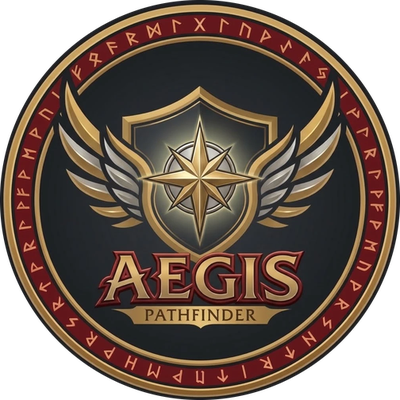 
  <b>Aegis: Pathfinder — levelling, gear and professions for vanilla WoW</b>

---

### 📷 In game

  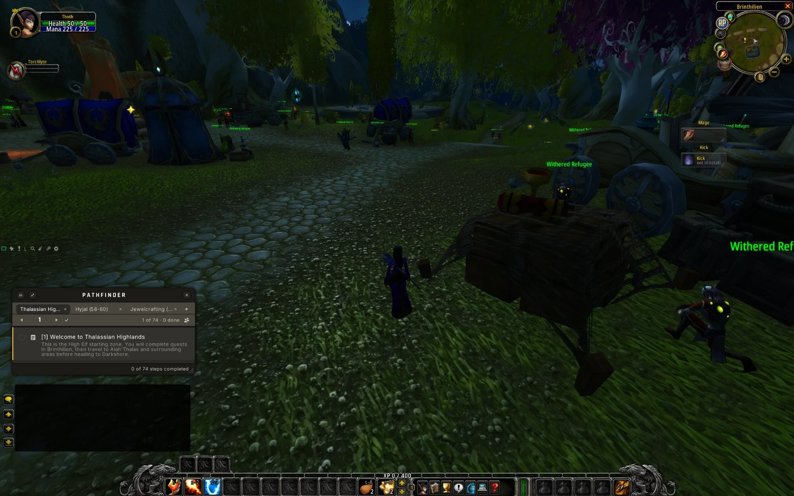

---

## Contents

- [What it does](#what-it-does) — guides, arrow, filters, gear, professions
- [Install](#install) · [Using it](#using-it)
- [Something broken?](#something-broken) · [Contributing](#contributing)
- [Credits](#credits) · [License](#license)

Every feature in full detail: **[docs/FEATURES.md](docs/FEATURES.md)**.

---

## What it does

### 🧭 Guides that follow you

1–60 for every race: **Optimized** (Joana's routes), **RestedXP**, **RXP
Hardcore**, and **Kamisayo Speedrun** for Horde warriors. Steps tick themselves
off as you accept, complete and turn in quests. Finish a guide and it offers
the next — or one of your server's custom zones, if one fits your level.

**First-time setup.** The first time you log in, three quick steps pick your
guide, what it includes, and the dungeons you mean to run. Run it again any
time with `/apg setup`.

  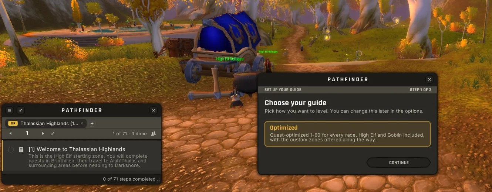

| Choose your features | Choose your dungeons |
| :---: | :---: |
| 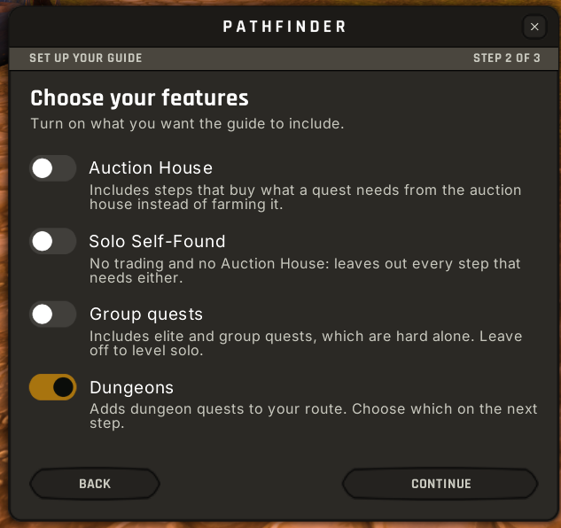 | 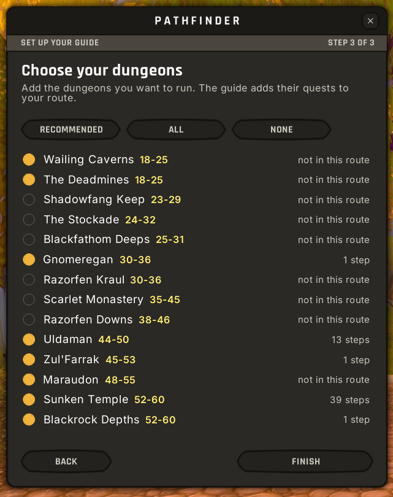 |

### 🎯 An arrow to every objective

A navigation arrow floats on the world with the distance and time to the step.
Waypoints and map pins go through **TomTom** or **pfQuest**.

### 🎛️ Play it your way

**Solo** or **group**, **Auction House** steps on or off, and only the dungeons
you mean to run. **Solo Self-Found** holds all three off: no group quests, no
dungeons, no trading, no Auction House. Every switch applies to every guide.

### 🛡️ Gear

- **Item score** on every tooltip: what an item is worth to your spec, and how
  it compares with what you wear. Weights from OctoPawn, yours to change.
- **Gear Advisor** offers upgrades as you loot them and marks the best quest
  reward.
- **Gear finder** lists the upgrades waiting in the dungeons you run — who
  drops them, where, and how often. At 60 that is every dungeon, and the
  raids too if you ask it.

<!-- Screenshots to come: the Item Score page, the Gear Advisor pop-up and the
     Gear finder. Put them in docs/images/ and add them here. -->

### ⚒️ Professions

All fourteen, 1–300, with trainers, reagents and a shopping list — and the
**cheapest route to 300** at today's auction house prices. With
[Aegis: Exchange](https://github.com/Torchlite-bit/Aegis_Exchange), the shopping
list goes straight onto its Crafting tab.

### 🗡️ Quest helpers

Buttons for the step's quest items and targets, raid marks on the mobs your
quests want, and two macros that follow the guide from an action bar.

  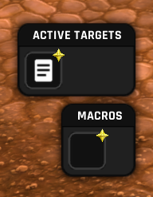

### 🤝 Play together *(beta)*

Share a guide with your party: everyone's progress under the step, and a
finished step waits for the slowest.

  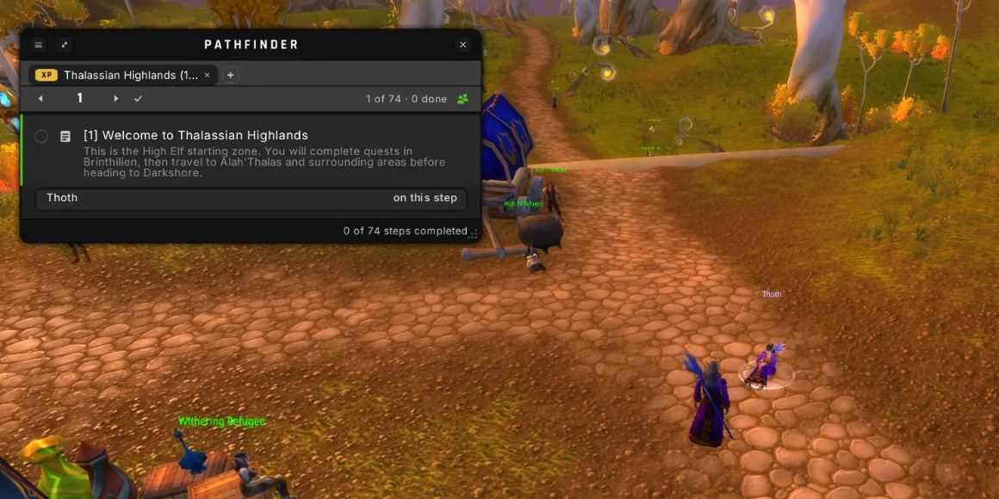

| Quest targets, shared | Share with your party | Everyone's progress on the step |
| :---: | :---: | :---: |
| 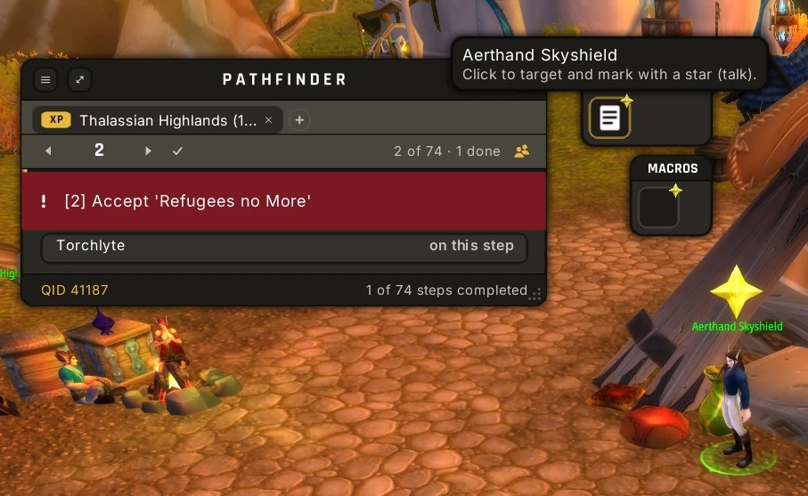 | 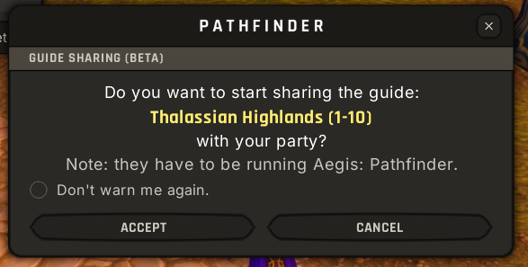 | 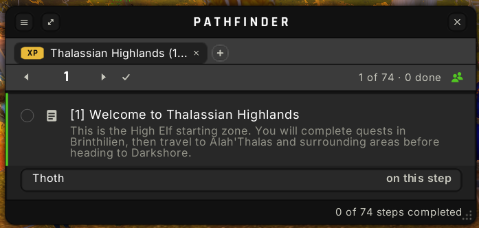 |

### ⚙️ Settings, laid out like Zygor's

Every setting in one window, a page a category down the left: your route,
dungeons, filters, appearance, gear and item score, behaviour, navigation.
Resize it from the corner.

| Route | Dungeons |
| :---: | :---: |
| 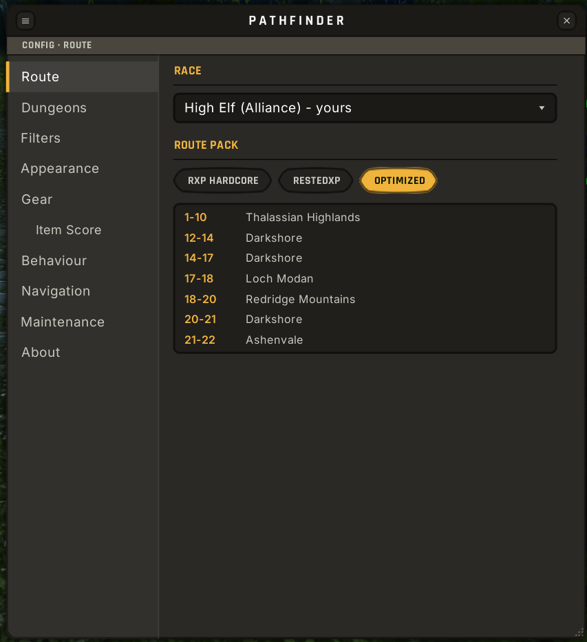 | 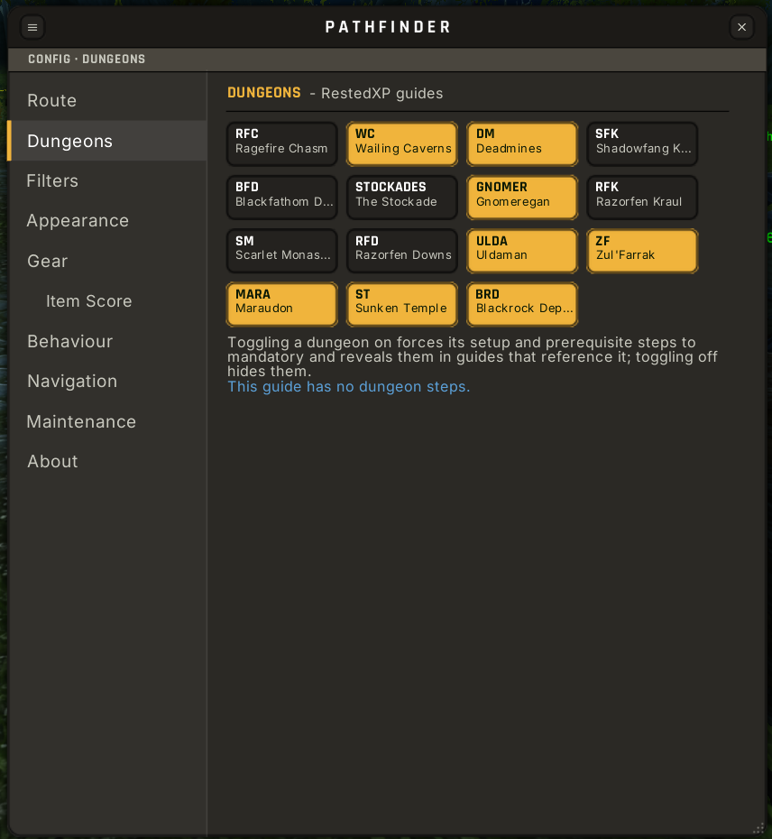 |

| Behaviour | Gear |
| :---: | :---: |
| 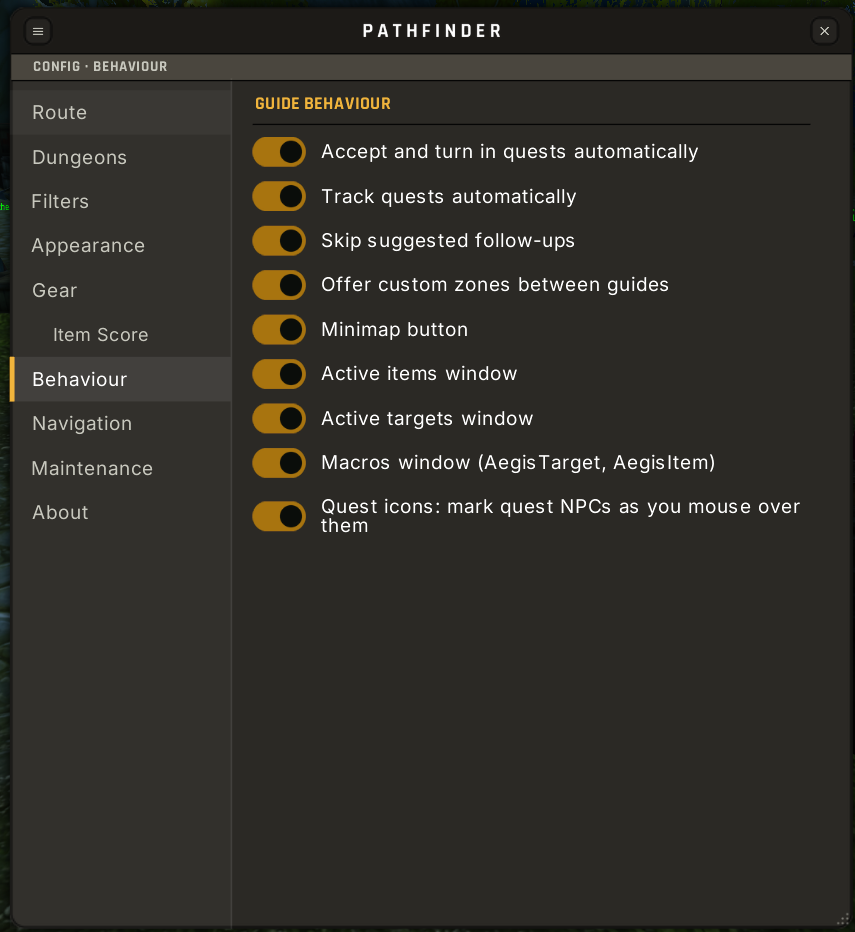 | 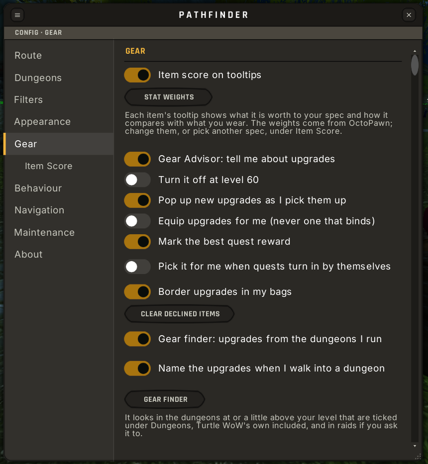 |

### 🎨 Your server's colours

Themes for Turtle WoW, Octo WoW, RavenCraft and Capybara Paradise, plus Day and
Night — applied at once, no reload.

---

## Install

1. Install **[ClassicAPI](https://github.com/brues-code/ClassicAPI) v1.5.9 or
   newer**. It is required; the addon will not load without it.
2. Put the addon in `Interface/AddOns/`, in a folder named `Aegis_Pathfinder`.
3. **Restart the client.** A `/reload` does not pick up new files.

Recommended: [TomTom-TWOW](https://github.com/laytya/TomTom-TWOW) for
waypoints, and [pfQuest](https://github.com/shagu/pfQuest) with your server's
database (`pfQuest-turtle`, or `pfQuest-octo` on Octo WoW) for quest givers and
targets.

Coming from TurtleGuide or VanillaGuide+? Your progress carries over.

## Using it

The logo on the minimap's edge: **click** to show or hide the guide,
**right-click** for the options, **drag** to move it. In the guide, the ◀ ▶
arrows step back or on; **right-click** them to jump back or on to your place.

| Command | |
|---|---|
| `/apg` | Open the guide |
| `/apg setup` | Run the first-time setup again |
| `/apg gear` | Your stat weights (options → Item Score) |
| `/apg finder` | Upgrades in the dungeons you run |
| `/apg craft` | Cheapest route to 300 in a profession |
| `/apg share` | Share your guide with your party |
| `/apg ssf` | Solo Self-Found on or off |

`/pathfinder` works too. [All commands](docs/FEATURES.md#commands).

---

## Something broken?

1. Check the **version** in the load message or the options window's About page (`v0.9.0`) — quote it.
2. Open the **Error log** (options → Maintenance) and copy what it shows.
3. Say which guide and step you were on, and which server you play on.
4. Tell us on **[Discord](https://discord.gg/Hr66t25vE7)** or open an
   [issue](https://github.com/Torchlite-bit/Aegis_Pathfinder/issues).
   Screenshots help enormously.

Recent changes are in [CHANGELOG.md](CHANGELOG.md).

---

## Contributing

PRs welcome — say hi on **[Discord](https://discord.gg/Hr66t25vE7)** first if
you're planning something big. [CONTRIBUTING.md](CONTRIBUTING.md) has the
checks, the 1.12 / Lua 5.0 code rules and how versions work;
[docs/GUIDE_AUTHORING.md](docs/GUIDE_AUTHORING.md) covers writing guides.

## Credits

Built on other people's work: [TourGuide](https://github.com/TekNoLogic/TourGuide)
by **Tekkub**, [VanillaGuide](https://github.com/isalcedo/VanillaGuide) by
**isalcedo**, [VanillaGuide-Plus](https://github.com/brues-code/VanillaGuide-Plus)
by **NostalgiaGeek**, **Brues** and **DonutsDelivery**, and
[ClassicAPI](https://github.com/brues-code/ClassicAPI) by **Brues**. Routes by
**[Joana](https://www.joanasworld.com/)**, **mrmr**, and **RestedXP** (Tactics
and Zeroji). Data from [pfQuest](https://github.com/shagu/pfQuest) (**shagu**),
[CraftRoute](https://github.com/Kitymeowmeow-turt/CraftRoute) (**Kitymeowmeow**),
[OctoPawn](https://github.com/iGreed1993/OctoPawn) (**iGreed**) and
[CMaNGOS](https://github.com/cmangos/classic-db).

Everyone is listed in [CONTRIBUTORS.md](CONTRIBUTORS.md), and in game under
options → About → **Credits**.

A fan project, not affiliated with or endorsed by Blizzard Entertainment, Zygor
Guides LLC, RestedXP, or any server team. The interface follows conventions set
by Zygor and RestedXP; no art or code from either was used.

## License

GNU General Public License v3.0 — see [LICENSE](LICENSE). The item score's
weights come from OctoPawn under its MIT licence, carried in
`ItemScoreData.lua`; the Ace2 libraries and the fonts keep their own licences
(see [media/README.md](media/README.md)).

---

**[💬 Discord](https://discord.gg/Hr66t25vE7)** · **[📜 Changelog](CHANGELOG.md)** · **[🐛 Issues](https://github.com/Torchlite-bit/Aegis_Pathfinder/issues)**

*Aegis: Pathfinder is part of the Aegis addon series. Happy questing.* 🧭

